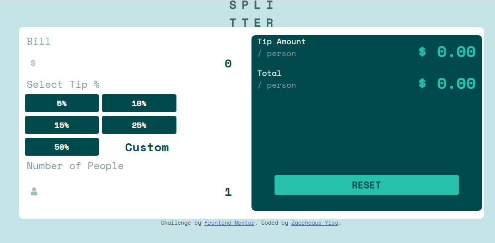

# Frontend Mentor - Tip calculator app solution

This is a solution to the [Tip calculator app challenge on Frontend Mentor](https://www.frontendmentor.io/challenges/tip-calculator-app-ugJNGbJUX). Frontend Mentor challenges help you improve your coding skills by building realistic projects.

## Table of contents

-   [Overview](#overview)
    -   [The challenge](#the-challenge)
    -   [Screenshot](#screenshot)
    -   [Links](#links)
-   [My process](#my-process)
    -   [Built with](#built-with)
    -   [What I learned](#what-i-learned)
    -   [Continued development](#continued-development)
    -   [Useful resources](#useful-resources)
-   [Author](#author)

## Overview

### The challenge

Users should be able to:

-   View the optimal layout for the app depending on their device's screen size
-   See hover states for all interactive elements on the page
-   Calculate the correct tip and total cost of the bill per person

### Screenshot



### Links

-   Solution URL: [Reepository on Github](https://github.com/Ndace-hash/Fem-Tip-Calculator)
-   Live Site URL: [Github pages](https://ndace-hash.github.io/Fem-Tip-calculator/)

## My process

### Built with

-   Semantic HTML5 markup
-   CSS custom properties
-   Flexbox
-   CSS Grid
-   Mobile-first workflow
-   SCSS
-   Bootstrap

### What I learned

I used this project to learn the basics of Bootstrap.

-   The Bootstrap 12 column layout
-   CSS Grid systems and flexbox

```html
<h1 class="text-center text-white bg-black">Some HTML code I'm proud of</h1>
```

```SCSS
   p {
    color: var(--White);
    span {
      color: var(--DarkGrayishCyan2);
    }
  }
```

I also found out that it's okay to scrap all your old work and start all over if you are not fine with what you have.

### Continued development

-   More Sassy CSS features
-   Understanding proper javascript syntax e.g async $ await

### Useful resources

-   [The net ninja SCSS and Bootstrap playlists on Youtube](https://youtube.com/thenetninja) - THis helped me understand SCSS and Bootstrap better.

## Author

-   Website - [Talk With Zach](https://talkwithzach.netlify.app)
-   Frontend Mentor - [@Ndace-hash](https://www.https://www.frontendmentor.io/profile/Ndace-hash)
-   Twitter - [@Talk_With_Zach](https://www.twitter.com/Talk_With_Zach)
